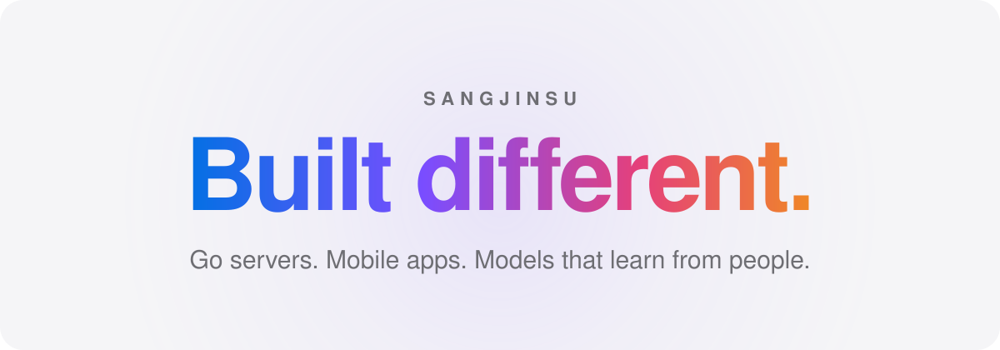

  <picture>
    <source media="(prefers-color-scheme: dark)" srcset="assets/hero-dark.svg">
    
  </picture>

 

  <b>Go 서버부터 일상의 앱까지.</b> 
  NHN에서 게임 기술 PM으로 일하며, Go로 게임 서버를 만듭니다. 
  요즘은 여행과 애니를 기록하는 앱, 그리고 사람의 선택을 배우는 작은 모델을 만들고 있습니다.

  <a href="https://sangjinsu.dev">sangjinsu.dev ›</a>
  &nbsp;&nbsp;·&nbsp;&nbsp;
  <a href="https://velog.io/@sangjinsu">Blog ›</a>
  &nbsp;&nbsp;·&nbsp;&nbsp;
  <a href="https://puzzlelab.sangjinsu.dev">Puzzle Content Lab ›</a>

  

<h2 align="center">Now building.</h2>

지금 만들고 있는 것들. 아직은 비공개입니다.

 

<h1 align="center">다녀</h1>
<h3 align="center">Been there. Wrote that.</h3>

  여행의 동선과 발견, 한 줄 기록을 하나의 흐름으로. 
  다녀온 곳이 모여, 나만의 여행 도감이 됩니다.

  <code>Expo</code> <code>React Native</code> <code>Supabase</code>

  

<h1 align="center">보니</h1>
<h3 align="center">“어디까지 보니?”</h3>

  보고 싶은 애니를 찾고, 무엇을 어디까지 봤는지 정확히. 
  회차마다 봤음 · 건너뜀까지 기억하는 나만의 애니 서재.

  <code>Flutter</code> <code>SQLite</code> <code>TMDB</code>

  

<h2 align="center">One more thing…</h2>

 

<h1 align="center">BDM</h1>
<h3 align="center">Learned from people.</h3>

  금액과 확률이 걸린 두 선택지 앞에서, 사람들은 무엇을 고를까. 
  실제 인간의 선택 데이터로 처음부터 학습하는 작은 신경망.

  <code>Python</code> <code>Behavioral Decision Model</code>

 

<h3 align="center">Coming soon.</h3>

  

<h2 align="center">Previously.</h2>

먼저 만들어 공개한 것들. 코드는 모두 열려 있습니다.

<table>
  <tr>
    <td align="center" valign="top" width="50%">
      <h3>Orbis</h3>
      <b>The loop, owned.</b>
        
      LLM 대신 런타임이 루프를 쥡니다. 
      오래 달리는 AI 에이전트를 위한 Go 런타임.
        
      <code>Go</code> <code>WebSocket</code>
        
      <a href="https://github.com/sangjinsu/orbis">자세히 보기 ›</a>
        
    </td>
    <td align="center" valign="top" width="50%">
      <h3>Cole</h3>
      <b>Focus. Next. Finish.</b>
        
      할 일은 체크리스트에, 다음 한 수는 분석에. 
      서버도 계정도 필요 없는 로컬 우선 데스크톱 앱.
        
      <code>Rust</code> <code>Tauri v2</code> <code>React</code>
        
      <a href="https://github.com/sangjinsu/cole">자세히 보기 ›</a>
        
    </td>
  </tr>
  <tr>
    <td align="center" valign="top" width="50%">
      <h3>Skill Execution Bench</h3>
      <b>Code beats prose.</b>
        
      같은 스킬을 네 가지로 포장해 에이전트에게. 
      코드로 건넨 3종은 100%, 글로만 건넨 스킬은 최저 71.7%.
        
      <code>Python</code> <code>Go</code> <code>Claude</code>
        
      <a href="https://github.com/sangjinsu/skill-execution-bench">자세히 보기 ›</a>
        
    </td>
    <td align="center" valign="top" width="50%">
      <h3>Heuristic Engineering Bench</h3>
      <b>Measured, not assumed.</b>
        
      휴리스틱을 더하면 더 똑똑해질까? 140번 실측한 답은 
      “정확도는 그대로, 시간만 늘었다.” 결과를 그대로 공개합니다.
        
      <code>Python</code> <code>LLM</code>
        
      <a href="https://github.com/sangjinsu/heuristic-engineering-benchmark">자세히 보기 ›</a>
        
    </td>
  </tr>
  <tr>
    <td align="center" valign="top" width="50%">
      <h3>Monolith OTel Lab</h3>
      <b>See inside the monolith.</b>
        
      Controller에서 DB까지, 요청 한 건의 여정을 
      trace · metrics · logs로 따라갑니다.
        
      <code>Spring Boot</code> <code>OpenTelemetry</code>
        
      <a href="https://github.com/sangjinsu/monolith-otel-lab">자세히 보기 ›</a>
        
    </td>
    <td align="center" valign="top" width="50%">
      <h3>Agent Context Loader Bench</h3>
      <b>Right context, right skill.</b>
        
      같은 지침, 다른 컨텍스트 로딩 전략. 
      에이전트의 행동은 무엇이 달라질까.
        
      <code>Python</code> <code>LLM</code>
        
      <a href="https://github.com/sangjinsu/agent-context-loader-bench">자세히 보기 ›</a>
        
    </td>
  </tr>
</table>

  

<h2 align="center">For Claude Code, and you.</h2>

매일 쓰다 불편해서 만들었습니다. 이제 여러분 차례입니다.

| 제품 | 한마디로 |
|:--|:--|
| **[whichcli](https://whichcli.vercel.app)** `Next.js` `Supabase` | 어떤 CLI를 써야 할지 고민 끝. 검색하고, 설치 명령은 한 번에 복사. |
| **[whichcli-mcp](https://github.com/sangjinsu/whichcli-mcp)** `TypeScript` `MCP` | 그 검색을 에이전트 안에서. `npx whichcli-mcp` 한 줄이면 585+ 도구가 손끝에. |
| **[skillvault](https://github.com/sangjinsu/claude-code-skill-vault)** `Go` `SQLite FTS5` | 스킬이 수백 개여도, Claude에게는 지금 필요한 것만. 팀을 위한 로컬 우선 스킬 매니저. |
| **[claude-plugin-dashboard](https://github.com/sangjinsu/claude-plugin-dashboard)** `TypeScript` | JSON 손편집은 이제 그만. 플러그인과 MCP 서버를 브라우저에서 보고, 켜고, 찾으세요. |
| **[claude-workflow](https://github.com/sangjinsu/claude-workflow)** `YAML` | 배포도, 장애 대응도 YAML 한 장으로. 의존성 0, Claude Code가 순서대로 실행합니다. |
| **[nhn-cli](https://github.com/sangjinsu/nhn-cli)** `Go` | AWS CLI처럼, NHN Cloud를. VPC부터 Compute, Gamebase까지 터미널에서. |

  

<h2 align="center">By the numbers.</h2>

<table>
  <tr>
    <td align="center" width="25%">&emsp;&emsp;&emsp;&emsp;&emsp;&emsp;
      <h1><a href="https://github.com/sangjinsu/coupon-system">5,600+</a></h1>
      초당 쿠폰 발급 요청 과발급 0
    </td>
    <td align="center" width="25%">&emsp;&emsp;&emsp;&emsp;&emsp;&emsp;
      <h1><a href="https://whichcli.vercel.app">585+</a></h1>
      검색 가능한 CLI 도구·스킬
    </td>
    <td align="center" width="25%">&emsp;&emsp;&emsp;&emsp;&emsp;&emsp;
      <h1><a href="https://github.com/sangjinsu/heuristic-engineering-benchmark">140</a></h1>
      벤치마크 실측 실행
    </td>
    <td align="center" width="25%">&emsp;&emsp;&emsp;&emsp;&emsp;&emsp;
      <h1><a href="https://github.com/sangjinsu?tab=repositories">228</a></h1>
      공개 저장소
    </td>
  </tr>
</table>

  

<h2 align="center">Under the hood.</h2>

  <picture>
    <source media="(prefers-color-scheme: dark)" srcset="https://skillicons.dev/icons?i=go%2Crust%2Cts%2Cpy%2Cjava%2Cspring%2Creact%2Cnextjs%2Cflutter%2Ctauri%2Ckubernetes%2Cdocker%2Cterraform%2Cgithubactions%2Cpostgres%2Cmysql%2Credis%2Csupabase%2Cgrafana%2Cprometheus&perline=10&theme=dark">
    
  </picture>

 

<b>클래식 컬렉션</b> — 여전히 잘 돌아갑니다.

 

| | |
|:--|:--|
| [coupon-system](https://github.com/sangjinsu/coupon-system) | 초당 5,600+ 요청에도 과발급 0. Redis 분산 락 + PostgreSQL 트랜잭션 `Go` |
| [sse-multistack-demo](https://github.com/sangjinsu/sse-multistack-demo) | Go · Node.js · Python, 4개 프레임워크로 구현한 SSE `JavaScript` |
| [go-project-cli](https://github.com/sangjinsu/go-project-cli) | Go 프로젝트 스캐폴딩 `Python` |
| [gord](https://github.com/sangjinsu/gord) | GORM 제네릭 레포지토리 `Go` |
| [chalk](https://github.com/sangjinsu/chalk) | 터미널 출력을 꾸며주는 패키지 `Go` |

 

  <picture>
    <source media="(prefers-color-scheme: dark)" srcset="https://leetcard.jacoblin.cool/FqWACkZ8Xt?theme=dark&font=Fira+Code&border=0&ext=heatmap">
    
  </picture>

Designed by sangjinsu in Korea.

